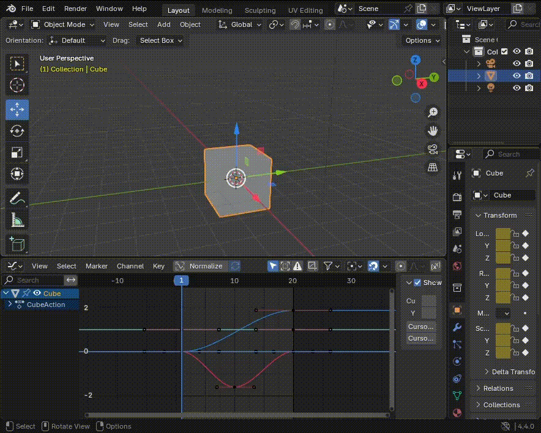

# Animation Auto Offset

This add-on provides a new animation editing mode, in which any changes to the object or bone transform (or other properties) will automatically propagate to all of the exisiting keyframes. You can use the standard move, rotate and scale operators or type in the values directly, no need to mess with the graph editor.

