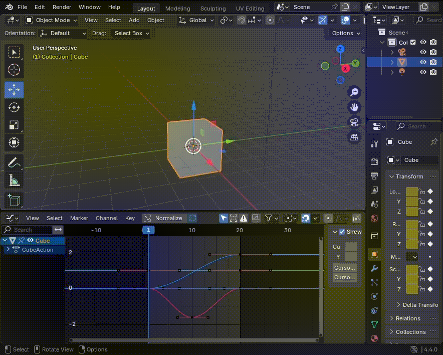

# Animation Auto Offset

This add-on provides a new animation editing mode. When activated, any change to the transform (or any animatable property) of the object or bone propagates to all (or selected) keyframes at once, keeping the relative offset. This allows you to, e.g. use the standard move/rotate/scale operators to offset poses, without having to mess with the graph editor.

NOTE: This has no effect with auto-keying enabled at the same time! You can enable 'Auto keying override' found in the add-on's preferences to temporarily disable it.

